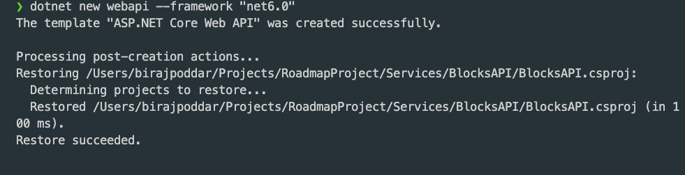
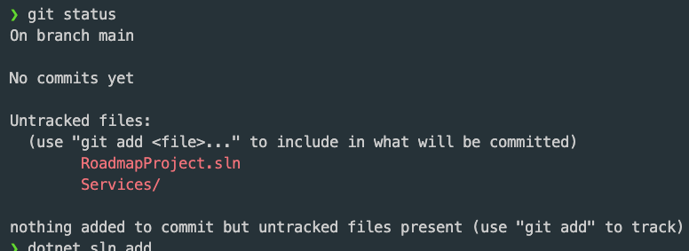
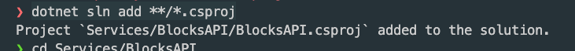
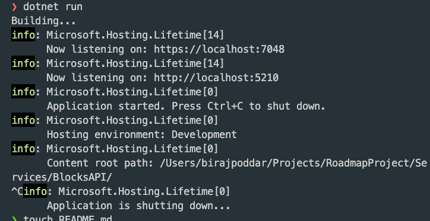

# How the Project was created

> [← Go Back](../README.md)

## Day 1

The project is created using the dotnet CLI

Command flow:

- `dotnet new sln` -- This command created the Solution.
- `md Services/BlocksAPI` -- This command created the nested folders.
- `cd Services/BlocksAPI` -- This navigated to the newly created folder.
- `dotnet new webapi -f "net6.0"` -- This created the WebApi project in the BlocksAPI folder by the same name.
  
- `dotnet new gitignore` -- This added the GITIGNORE file to the Project.
- `cd ../../` - Navigatng to the root path or solution path.
- `git init` -- Initiating the GIT repo at the root.
- `git status` -- To check the number of changes pending.
  
- `dotnet sln add **/*.csproj` -- Adding the newly added project to the solution.
  
- `cd Services/BlocksAPI` -- Navigating to the Project
- `dotnet build` -- To build the Project.
- `dotnet run` -- To execute the project.
  
- `cd ../..` -- Navigating to the root.
- `dotnet new editorconfig` -- Creating the editor config and installing the **'EditorConfig for VS Code'** extension to enable support for editorconfig
- `touch README.md` - Creating the README file for the solution.

---

Finally filling up all the details in the README file along with images.

> [← Go Back](../README.md) | [↑ Go Top](#how-the-project-was-created)
